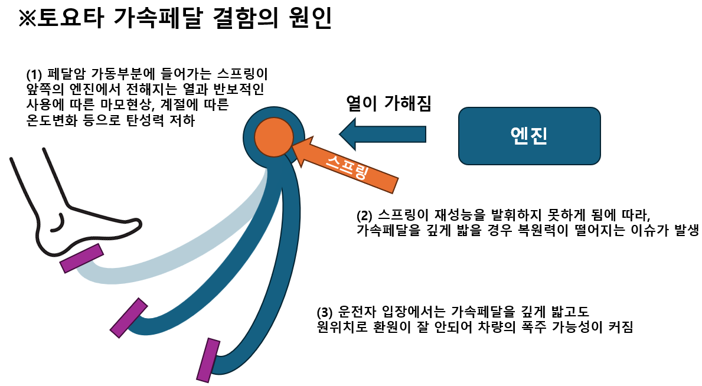
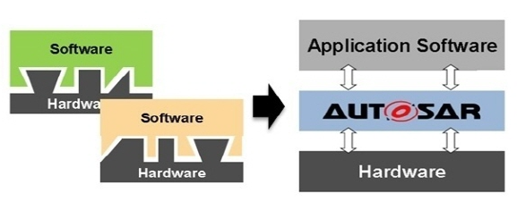
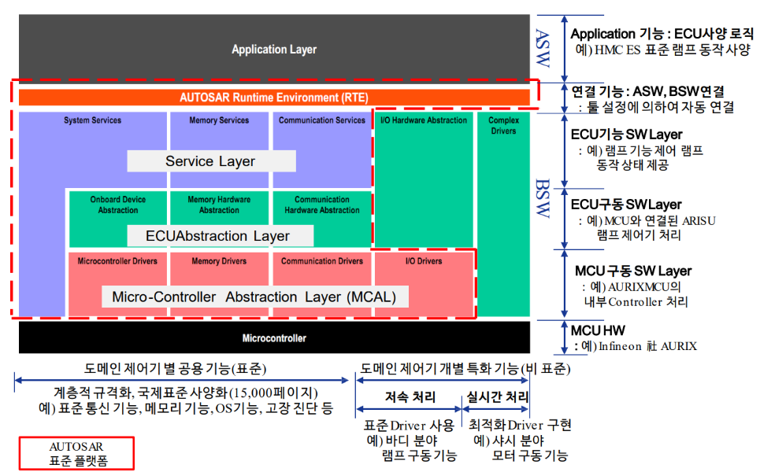
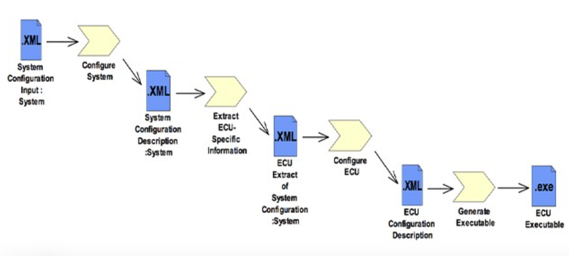

# AUTOSAR CP IO 1

우선 오토사가 뭔지에 대해 들어가기에 앞서 한가지 사건을 알아볼 필요가 있다.

바로 [토요타 리콜사태](https://namu.wiki/w/%ED%86%A0%EC%9A%94%ED%83%80%20%EB%A6%AC%EC%BD%9C%20%EC%82%AC%ED%83%9C)이다.

## 판매 1위 탈환한 토요타 역대 최악의 리콜사태

이는 2009년부터 2010년까지 발생한 급발진으로 인한 토요타의 리콜사태로, 자동차 관련 리콜중 사상최대규모이며, 이에 따른 손실액 또한 역대 최대이다.

이 사건으로 토요타라는 자이언트기업 하나가 휘청이었으며, 현재처럼 정상궤도로 돌아오기까지 많은 시간이 소요되었다.

이 사건의 원인은 다음과 같다.

- 원인(1): 매트의 결함
- 원인(2): 가속페달(Accelerator) 자체의 결함
- 원인(3): TPS시스템의 문제

### 원인(1): 매트의 결함

토요타의 일부차량에서 매트가 엑셀러레이터에 껴버려서 페달을 밟지 않고도 가속이 되는 문제가 발생했다. 말 그대로 설계상의 허점이 있었던 것이다.

이로 인해 대량의 리콜이 발생했으나, 그나마 이정도는 커버가 되었으나 2010년에 들어서부터 사태가 커지기 시작하는데,,,

### 원인(2): 가속페달(Accelerator) 자체의 결함

가속페달을 밟은뒤 원위치로 빨리 돌아와야 운전자가 가속을 쉽게 조절할수가 있는데, 복원이 잘 안되는 문제가 발생했다.

처음에는 토요타에서 이런 가능성에 대해 부인하였으나, 언론이 밝혀낸 구체적인 결함이 알려진 뒤에 조치를 취한 인상을 주게됨에 따라 토요타 자체의 이미지에도 많은 타격을 주게 되었다.

### 원인(3):TPS시스템의 문제

초기에 토요타는 ECU오류가 없다고 주장으을 한 상황이었다. 그러나 토요타는 바(BAAR)그룹이 제출한 ([토요타 급발진 조사 보고서](https://www.safetyresearch.net/Library/BarrSlides_FINAL_SCRUBBED.pdf))에서 전자제어장치(ECU)에 내장된 SW의 오류를 확인하고 실험을 통해 결함을 공식인정하게 되면서 그 파장은 커지게 되었다.([관련기사링크](https://n.news.naver.com/mnews/article/030/0002265159?sid=103))

좀더 살펴보자면, ECU위에 올라간 SW내부에서 캔통신을 통해 정보를 주고받을때 특정 메모리 영역을 공유하게 되어 있는데, 이때 이 공유지점에서 Interference가 발생하여 ETCS에 잘못된 Order가 내려짐에 따라 이것이 급발진으로 이루어지게 된 것이다.

## 후일담

위 사건으로 미국의 자동차 업계, 빅3인 **GM**, **Ford**, **CHRYSLER**는 금융위기의 여파로 쓸려나갈 뻔 했다가 위 사건을 계기로 치고 올라가게 되면서 회생에 성공했다.

## 스마트카와 더불어 떠오른 오토사

위 사건에서도 보았듯이, 자동차가 전자기기화되면서 안전성우려가 커지고 있다.
따라서 안전을 위한 각종 규제가 표준으로 자리잡기 시작했는데, 그 가운데에 오토사(AUTOSAR)가 있다.

오토사는 '개방형 자동차 표준 소프트웨어 구조(AUTomotive Open System ARchitecture)'의 약자로 자동차가 전자기기화 되어가는 흐름 속에 다양한 회사들이 협력해서 만든 표준화된 자동차 전장 플랫폼이다.

현재 국내에서는 현대자동차와 에트리뿐만 아니라 LG전자도 유일한 IT기업으로 오토사 공동개발에 참여하고 있다([링크](https://www.lg.co.kr/media/release/6716))

최근에 출시된 아이오닉5만 보아도 차체에 100여개 이상의 전장부품이 탑재되고 있는 실정이다.
우리가 흔히 아는 변속기와 브레이크부터 에어백, 전동 윈도우에 이르기까지, 각 전장부품에 1개 이상의 프로세서(MCU 또는 AP)를 장착하며, 개별 프로세서마다 각각의 고유한 OS(Free RTOS, Linux)를 탑재하고 있다.

자 이렇게 자동차가 마치 하나의 컴퓨터처럼 변화를 도모하게 됨에 따라 이 자체로 하나의 표준화된 플랫폼이 필요해졌으며, AUTOSAR개발은 현재로 아래와 같은 모토 아래 계속해서 이어지고 있다.

> Cooperate on Standards - Compete on implementation
>
> -표준을 만들때는 협력하고, 적용할때는 경쟁한다-

오토사의 종류는 크게 두가지로 나눌 수 있다.

- AUTOSAR CP(Classic Platform): ([링크](https://www.autosar.org/standards/classic-platform))
- AUTOSAR AP(Adaptive Platform): ([링크](https://www.autosar.org/standards/adaptive-platform))

위 플랫폼은 이제 아래와 같이 전장부품, 그리고 운영체제와도 하나의 결로 묶이게 된다.

- AUTOSAR CP + MCU + Free RTOS

- AUTOSAR AP + AP + Linux

## Main Working Topics

오토사의 핵심주제는 크게 3가지로 나눌 수 있을 것 같다.

- Architecture
- Methodology
- Application Interfaces

### 1)Architecture

오토사 아키텍처의 그림을 크게 위와 같이 나타낼 수 있다.

여기서 각각의 박스(블럭)들은 하나의 소프트웨어 기능단위로서, SW Component라고 부른다.
숲을 이루는 것이 나무인 것처럼, 오토사 아키텍처를 이루는 것이 이 SW컴포넌트라 보면 된다.

이 무수히 많은 컴포넌트들은 이제 계층별로 보면 이해를 도울 수 있을 것 같다.

이 아키텍처는 크게보면, ASW+BSW의 조합이라 볼수도 있고, 또는 BSW를 RTE와 BSW로 분리해서 보면,  ASW+RTE+BSW의 조합이라 볼수도 있을 것 같다.

이제 조금 다른 얘기로 넘어가자.
친형의 경우에는 여쭤보니 MCU의 오토사 CP안에서 "BSW", "BSW"안에서 MCAL쪽의 개발을 맡고 있다고 한다. 참고로 "MCAL"은 마이크로 컨트롤러 업스트랙션 레이어로, BSW안에 있는 추상화계층을 말한다.

그러면 이제 ASW, RTE, BSW가 뭔지부터 알아보자.

1. BSW
   BSW는 위에서 소프트웨어라고 말했는데, 아키텍처의 표준이라는 큰 청사진의 관점에서 보면 '하위 레이' 라고도 볼 수 있을 것이다.
   이 계층은 다음과 같은 모듈로 구성되어 있다.

   - MicroController Abstraction Layer(MCAL)
   - ECU Abstraction Layer
   - Services Layer
   - Complex Device Drivers(CDD)

   (여기서 특히 MCAL이 중요한데, 왜냐하면 오토사 아키텍처 내에서 다른 부분들은 나름 엄격하게 틀이 잡혀 있는데, 이 MCAL이라고 하는 레이어는 각각 회사에서 어떤 MCU를 끌어와서 쓰냐, 즉 NXP제품을 쓰냐, 인피니언 제품을 쓰냐에 따라 DOC를 보고 각각 다른 레지스터를 개별적으로 참조해주어야 하므로, 틀이 거의 안잡혀 있어서 이에 대해 일일이 코딩을 해주어야 한다고 한다)

2. RTE
   말 그대로 런타임환경(RunTime Environment)이다. BSW와 ASW 사이에 위치하며, 두 계층간의 통신을 담당하는 미들웨어의 역할을 수행한다. 다음과 같은 주요기능을 제공한다.

   - Software Component Communication
   - Basic Software Interaction
   - Lifecycle Management

3. ASW
   마지막으로 ASW는 응용소프트웨어로 차량의 특정기능을 구현하는 소프트웨어 계층이다

### 2)Methodology

오토사는 고유한 개발방법론이 존재하고 이에 맞춰 개발을 진행하는 것이 일반적이다.

주요 요소는 아래와 같다.

1. Development Process
2. Model-Based Development(MBD)
3. Configuration and Integration

### 3)Application Interfaces

아까 전에 위에서 오토사 아키텍처를 구성하는 것은 SW컴포넌트라는 것을 알았다.

그러면 이 SW컴포넌트들 사이에 캔통신이든, 그 외에 다른 인터렉션들이 어떻게 일어나는지 알아야 하는데, 이때 바로 정해진 애플리케이션 인터페이스가 요구된다. 반드시 정해진 인터페이스 규약에 맞게 인터렉션이 이루어지는데, 하나의 ECU는 무조건 하나의 SW컴포넌트를 참조하거나, 여러개의 SW컴포넌트가 하나의 ECU를 참조하는 것이 가능하다.

